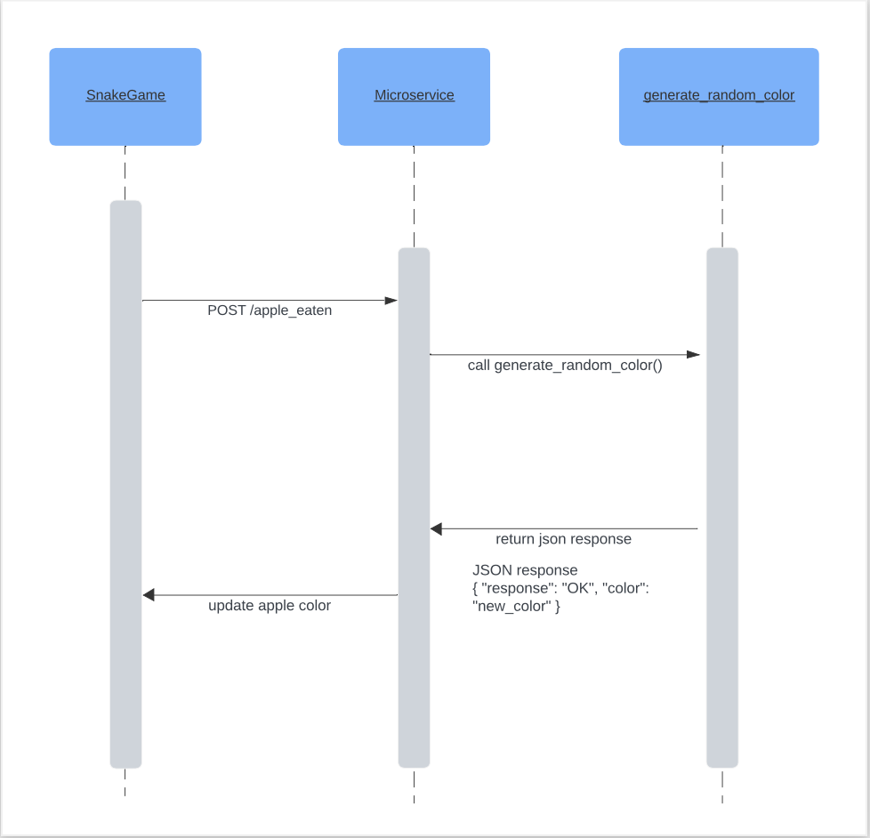

## Communication Contract

### Requesting Data from Microservice A

1. Send a POST request to the endpoint /apple_eaten.
2. Include the following headers:
- Content-Type: application/json
- Example request:
POST /apple_eaten HTTP/1.1
Host: localhost:5555
Content-Type: application/json


### Receiving Data from Microservice A
Microservice A will send a JSON data structure containing the following structure:
{
  "response": "OK",
  "color": "new_color"
}

To receive this structure, add code similar to this so that you may fetch the needed json data and interact with it as needed.

```
 try {
            const response = await fetch('http://localhost:5555/apple_eaten', {
                method: 'POST',
                headers: {
                    'Content-Type': 'application/json'
                }
            });
            const data = await response.json();
            if (data.response === 'OK') {
                // some action here with the data.color data
            }
        } catch (error) {
            console.error(error);
        }
```

## UML Sequence Diagram




